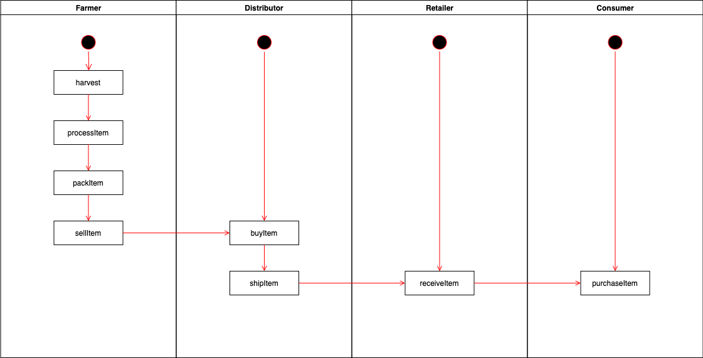
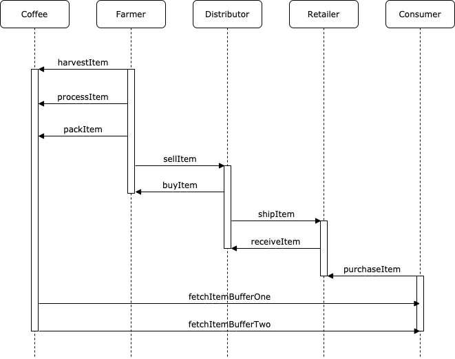
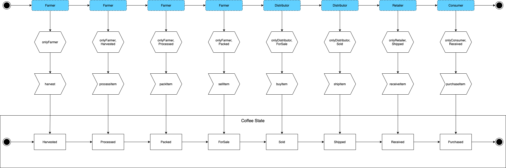
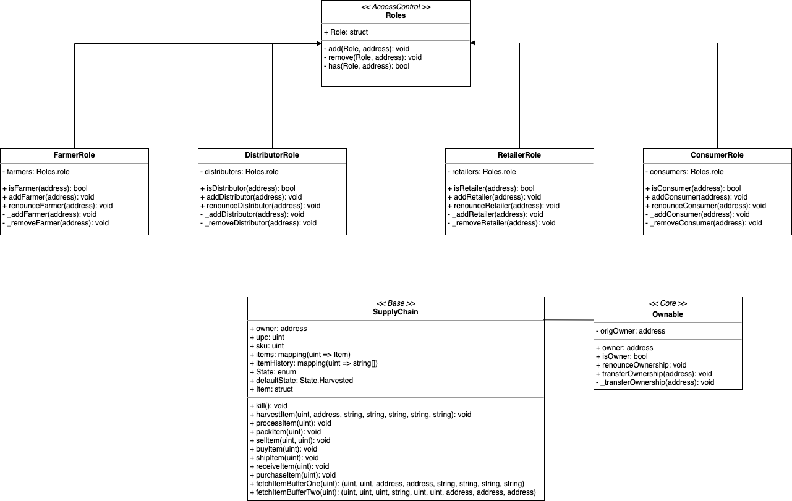

# Dependencies

- `@truffle/hdwallet-provider@^1.2.6` Updated to use latest repository
- `truffle-assertions@0.9.2` to test emitted events in smart contract
- `web3@^0.19.1` to make startup code work

IPFS is not used in this project.

# Rinkeby Network

## Transaction Hash

[0x1ed8c0afe7431cda029910b298defc6935548e94802089ccf2765b7b3db3f30e](https://rinkeby.etherscan.io/tx/0x1ed8c0afe7431cda029910b298defc6935548e94802089ccf2765b7b3db3f30e)

## Contract Address

[0xc15785A06433A0946A19688a58E5D87668230596](https://rinkeby.etherscan.io/address/0xc15785a06433a0946a19688a58e5d87668230596)

## Transaction History

- [X] Harvested - 0x4188481866d623902f20a35f33bc164087afcc18348724223dec6ead4591852c
- [X] Processed - 0x1452b164d36b7f8fe6a07ff21d0a3e6c6d958e93a2531d837a2bf260c20d34e8
- [X] Packed - 0x728971eb73d4ade8289781809e5ec021140413d7a37245f4b6764adf4ff60277
- [X] ForSale - 0xbea9420bcd6a2db1e0736c6325d4b4589758a32813c9d746ca1c6b92aa9c16e6
- [X] Sold - 0x05a69b148886a36f6658b294318d1a01ab078e1bf5e7b7c07ffe5b7defce565d
- [X] Shipped - 0x1d08c65846f0c1e2cb26b7d7173c71c10d701dfc4653c4191d65b7d61c71c853
- [X] Received - 0x4bcdc43397f43287470898ac3adddec9f7ccb0af14f86809de00f3245cee9920
- [X] Purchased - 0x0e69c7551e2c7717b759c2eebb4d1ba275568df809507dc2f7ac1b0769d443a2

# Diagrams

## Activity Diagram

## Sequence Diagram

## State Diagram

## Classes

